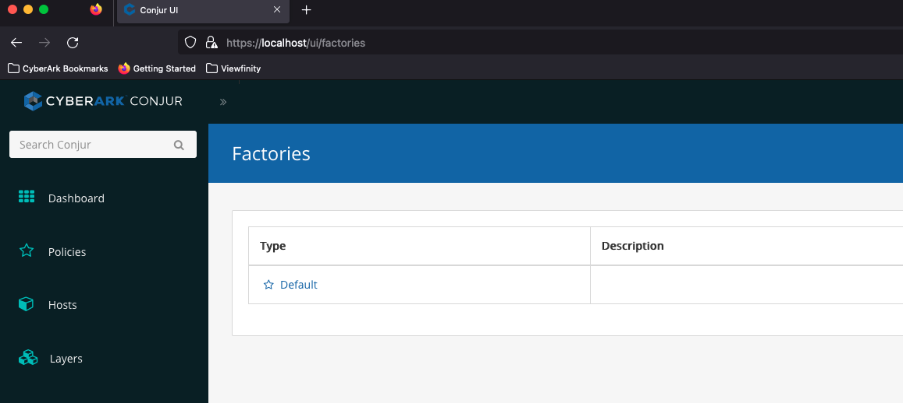
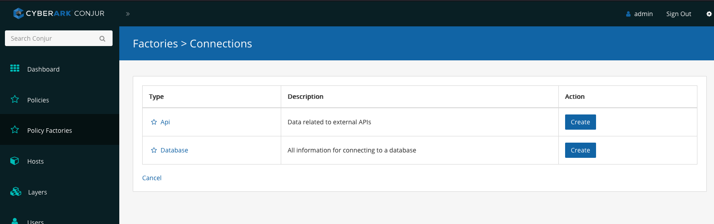
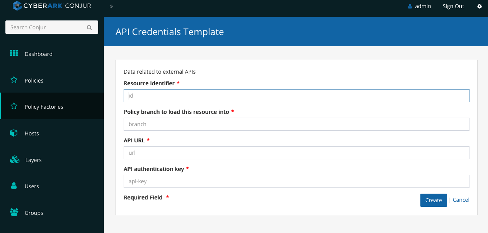
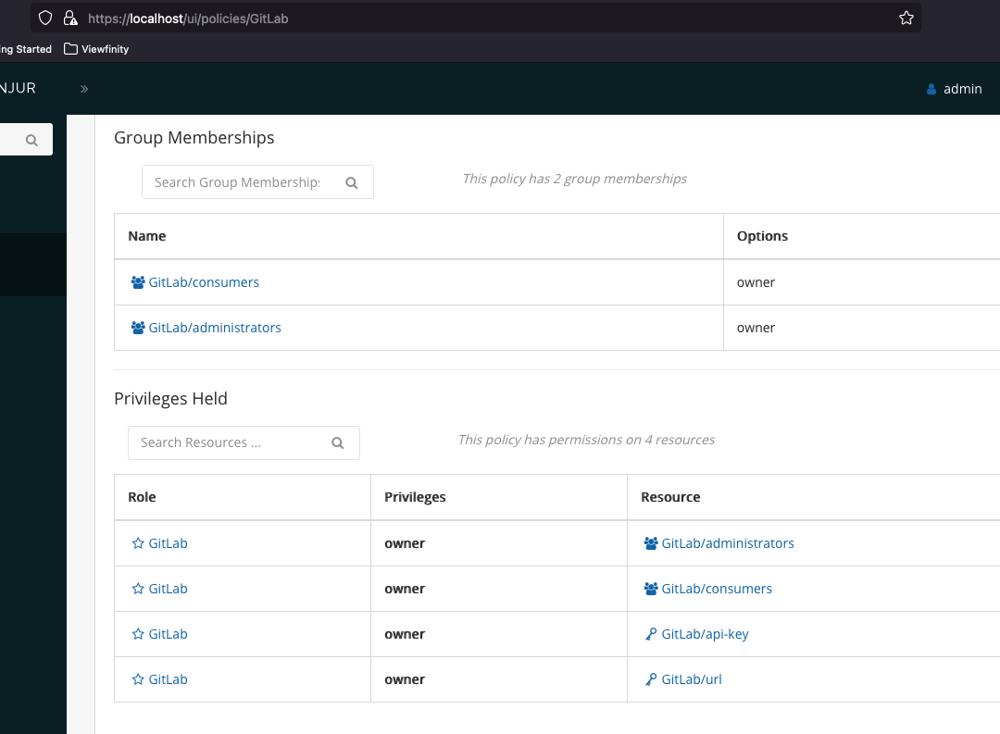

# Policy Factory Loader

This project aims to simplify the creation and loading of policy factories.  It
includes a set of Factories to serve as a starting point and as an example.

For a customer engagement, it's strongly suggested you clone this repository and use
a customer specific branch. This will allow you to generate factories to meet customer
specific needs.

## Resources

- How To
  - [Create a Simple Factory](docs/how-to-simple-factory.md)
- Reference
  - [API](docs/reference-api.md)
  - [CLI](docs/reference-cli.md)
  - [Configuration](docs/reference-configuration.md)
  - [Policy](docs/reference-policy.md)
  -

## Load Default Templates

This project includes a number of pre-constructed factories. Default templates include the following:

- Authenticators
    - AuthnJwt (using JWKS)
    - AuthnJwt (using public keys)
    - AuthnOIDC
- Connections
    - Database
- Core
  - Grant
  - Group
  - Host
  - Policy
  - User
  - Variable

To load the default set of Factories into Conjur (running via Conjur Intro), run:

```sh
CONJUR_URL=https://localhost ACCOUNT=demo CONJUR_USERNAME=admin bin/load default
```

To load Factories into a local Conjur development environment:

```sh
API_KEY=<api-key> CONJUR_URL=<http://localhost:3000> ACCOUNT=cucumber CONJUR_USERNAME=admin  bin/load
```

## Quickstart

*This quickstart assumes you've cloned this repository locally, and are calling commands from inside this project directory.*

### Factory with Variables

As an example, let's create a Policy Factory that simplifies the process of storing API credentials for various services that offer APIs. Before starting, let's define what we want:

- include two variables, `url`, and `api-key`
- create a group with permission to see and retrieve these variables
- create an admin group to administer these credentials

### Generate Factory Stubs

First, let's generate the necessary factory stubs:

```sh
bin/create --classification connections api
```

This command will create two files (`config.json` and `policy.yml` in `lib/templates/connections/api/v1`).

### Update Factory Configuration

Open the API Policy Factory config file: `lib/templates/connections/api/v1/config.json`.  It will look like the following:

```json
{
  "title": "",
  "description": "",
  "variables": {
    "variable-1": {
      "required": true,
      "description": ""
    },
    "variable-2": {
      "description": ""
    }
  }
}
```

Update it to the following:

```json
{
  "title": "API Credentials Template",
  "description": "Data related to external APIs",
  "policy_type": "variable-set",
  "variables": {
    "url": {
      "required": true,
      "description": "API URL"
    },
    "api-key": {
      "required": true,
      "description": "API authentication key"
    }
  }
}
```

Save and close the `config.json` file.

### Policy

In the above configuration, the attribute set `"policy_type": "variable-set"`
creates two groups: `consumers` and `administrators`. Consumers are able to view
and retrieve variable secrets. Administrators can do this in addition to updating
those variable values.

As we're using the CLI Factory compiler to generate the necessary policy for our API, we need to remove the empty `policy.yml` template:

```sh
rm lib/templates/connections/api/v1/policy.yml
```

### Load the Factory

*In order to load Policy Factories, your role needs permission to create policy in the `root` namespace. The following commands use a leader running via the Conjur Intro project.
*

Run the following command to load our API Policy Factory:

```sh
CONJUR_URL=https://localhost ACCOUNT=demo CONJUR_USERNAME=admin bin/load
```

*Note: you'll be prompted for the admin user password.*

### View and Use the Factory

In the UI, navigate to the Policy Factories page: ex. `https://localhost/ui/factories`.



Click `Connections`



Click the blue `Create` button for the API factory



To create a new set of API credentials with our factory, fill the fields in with the following:

- `Resource Identifier` - GitLab
- `Policy Branch` - root
- `API URL` - https://mydomain.gitlab.com
- `API Key` - supersecret123-key

After clicking the `Create` button, navigate to the policies page: `/ui/policies`

Notice we now have a policy `GitLab` in our list:


Clicking on the `GitLab` Policy, we can see the details, including our groups and variables.


